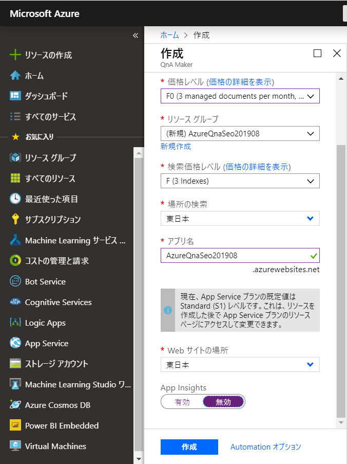

# ナレッジベースの作成

Q&A ボットを作成する作業の最初の手順として **ナレッジベースを作成** します。

ナレッジベース作成は、

1. Azure ポータルで QnA Service を作成する
2. QnA Maker ポータルから QnA Service に接続する
3. ナレッジベースに Q&A を登録する

の順に進めます。

---

## Azure ポータルで QnA Service を作成する

Azure ポータルで QnA Service (QnA Maker 用のテンプレートを適用した Bot Service) を作成します。

1. [**QnA Maker ポータル**](https://www.qnamaker.ai/) に接続してサインインします。
2. [Create a knowledge base] を選択します。  
   

3. "Create a knowledge base" が開くので、[**Create a QnA service**] をクリックします。  
   

4. Azure ポータルが自動的に開いて "QnA Maker" ブレードが表示されるので以下の入力・選択をします。最後に [作成] をクリックします。  

   |項目|値|
   |---|---|
   |名前|任意の名前、以下では "AzureQna" + 名前 + 日付 にしています)|
   |サブスクリプション|QnA Service を作成するサブスクリプション|
   |価格レベル|ハンズオンでは "F0" (選択可能な場合)|
   |リソースグループ|任意|
   |リソースグループの場所|任意、以下では "(アジア太平洋) 東日本"|
   |検索価格レベル|F (選択可能な場合)|
   |場所の検索|任意、以下では "東日本"|
   |アプリ名|任意、以下では "名前" から生成されるデフォルト値のまま|
   |Web サイトの場所|任意、以下では "東日本"|
   |App Insights|ハンズオンでは "無効"|

   
   

5. "QnA Service" が完成するのを待ちます。
6. 初期状態だと "App Service" は有料のプランになっています。ハンズオンの範囲では **無償のプラン** で充分なので、プランを変更します。  
   Azure ポータルの [検索ボックス] に、作成した "QnA Service" の名前を入力します。
7. 検索結果で "**App Service**" を選択します。
   

8. "App Service プラン" をクリックします。  
   

9. "App Service プラン" ブレードで [**スケールアップ**] を選択します。  
    

10. [開発/テスト]-[F1] を選択して [適用] をクリックします。  
   

---

## QnA Maker ポータルから QnA Service に接続する

QnA Maker ポータルに戻って、今作った QnA Service に接続します。

1. [**Refresh**] をクリックします。  
2. "QnA Service" に接続するために、以下の項目を選択します。  

   - Azure Directory ID
   - Azure subscription name
   - Azure Qna Service

3. ナレッジベースの名前を入力します。（任意の値、以下では "Oly"）  
   

4. [Populate your KB] に以下の URL を入力して、ナレッジをインポートします。  
     

   > このハンズオンでは、[**Azure サポートに関する FAQ**](https://azure.microsoft.com/ja-jp/support/faq/) ページの内容をインポートします。  
   >
   > https://azure.microsoft.com/ja-jp/support/faq/
   > 

   > 実務では Q&A の内容は、担当部署が Excel などで管理していることがあると思います。  
   >UTF-8 の タブ区切り形式で出力して、そのファイルを "Create a knowledge base" でインポートする運用がよいでしょう。

5. [**Create** your KB] をクリックして、ナレッジベースを作成します。
6. ナレッジベースができると、ナレッジベースの "Edit" 画面に自動的に遷移します。  
   

---

ナレッジベースの作成まで終わりました。  
今はまだナレッジベースを学習していないので Q&A ボットにはなっていません。

[次のステップ](./02_train_and_test_qna.md) では、ナレッジを学習して、ポータル上で Q&A の品質をテストします。
