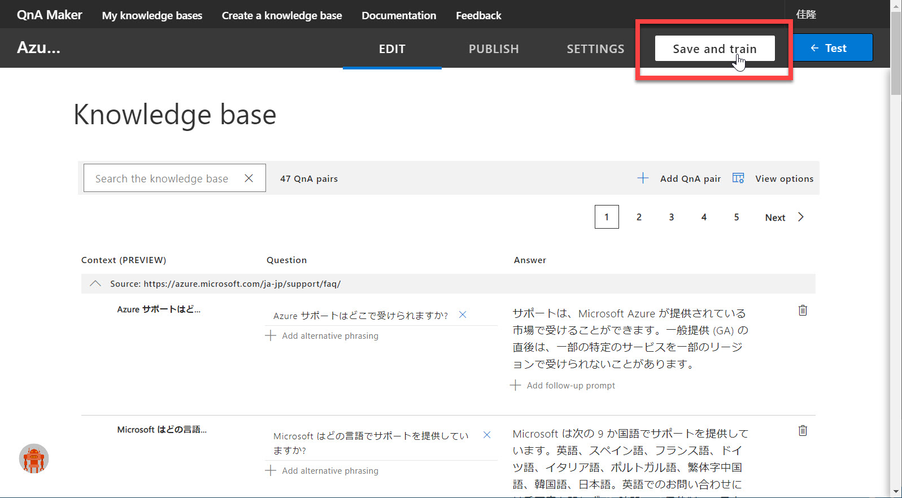
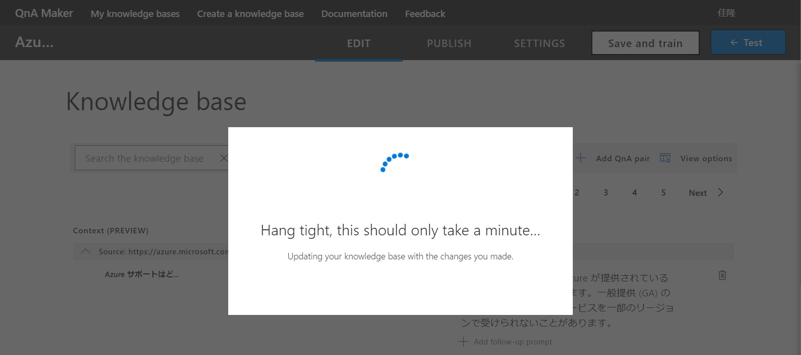
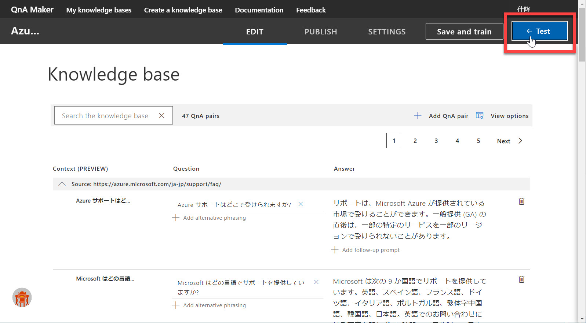
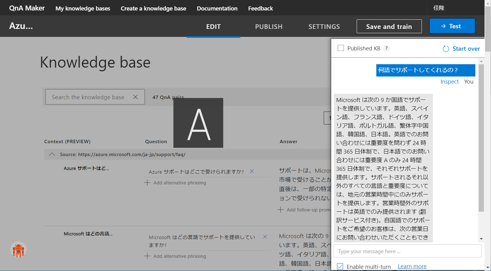
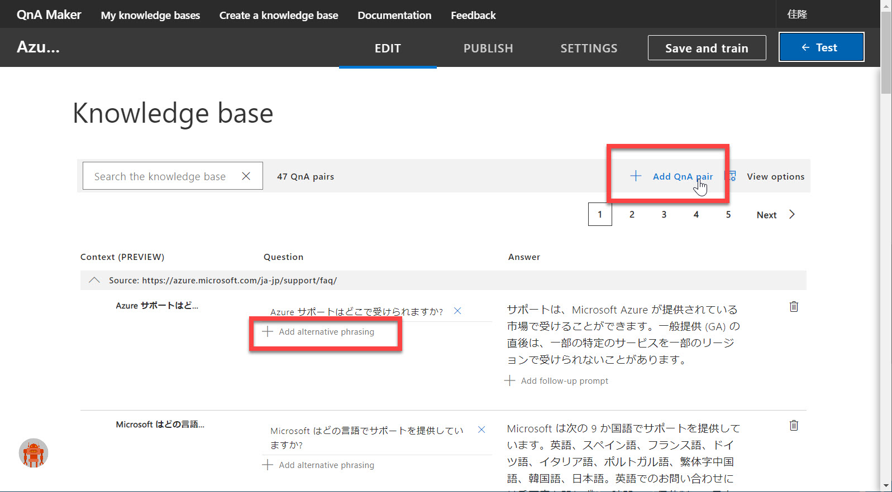
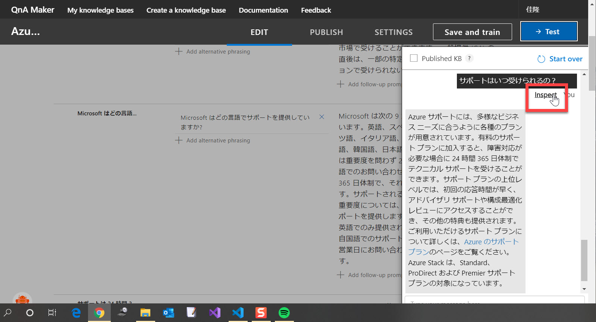
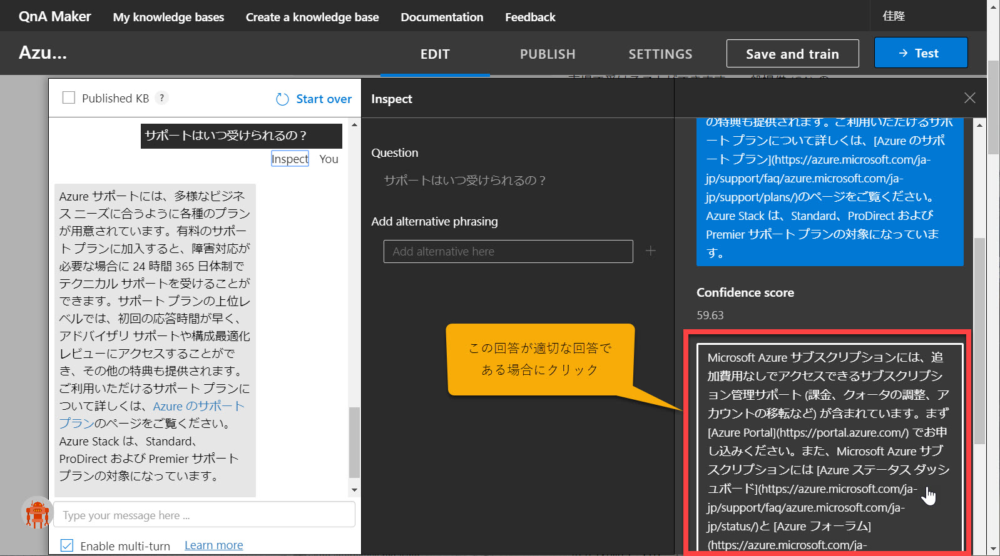
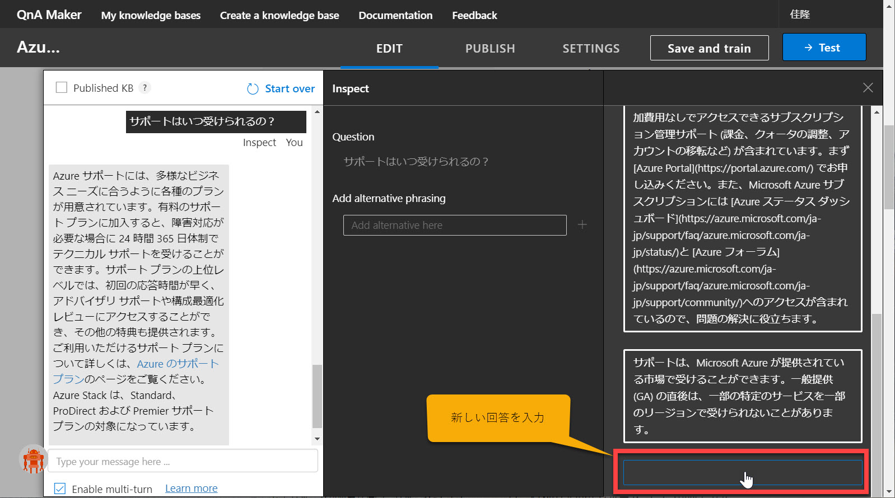

# ナレッジの学習とテスト

[前のステップ](./01_createknowledgebase.md) では、Azure ポータルで **QnA Service を作成** し、QnA Maker で **新しいナレッジベース** を作成しました。

以下では、

- ナレッジを学習
- ポータル上でテスト
- (必要に応じて) Question や Answer の追加登録や、適切ではない Q と A との関係づけを修正

を行います。

---

## ナレッジを学習

前のステップから続けて実施しているのであれば、ナレッジベースの再生に成功し、"Edit" 画面が表示されているはずです。  
この状態ではまだ学習は実施されていないので、ここで**学習**します。

1. ナレッジベースの "Edit" 画面で、[**Save and train**] をクリックします。  
   

2. 学習が終わるまで少し待ちます。  
   

3. 学習が終わると "Edit" 画面に自動的に戻ります。

---

## ポータル上でテスト

学習がすんだのでテストしてみます。  
QnA Maker ではポータル上でテストを行うことができます。

1. [**Test**] をクリックします。  
   

2. チャット画面が表示されるので、質問を入力します。  
   質問に応じた回答が返されます。  
   

   > ナレッジベースに取り込んだ質問そのものでなく、表現や語順を変える、似た言葉で言い換えるなどを試してください。

---

## (必要に応じて) Question や Answer の追加登録

> ※ハンズオンでは以下の操作は行いません。  
> QnA Maker の深い理解や実案件での開発前の参考としてください。

ナレッジベースは、いつでも追加変更することができます。

|追加登録したい内容|操作|
|---|---|
|Question - Answer の組み合わせを追加登録|Add QnA pair|
|ある Answer に紐づく Question を追加登録|Add alternative phrasing|

を行うことで、新しい QA のセットが追加されます。

"Edit" 画面で QA を追加変更しただけでは、QnA の学習済みモデルには反映されていません。  [**Save and train**] で再学習することで（および "Publish" することで）、新しい質問に適切に回答できるようになります。

---

## (必要に応じて) Question に対する Answer の関係づけを変更

> ※ハンズオンでは以下の操作は行いません。  
> QnA Maker の深い理解や実案件での開発前の参考としてください。

テストをしていると、適切ではない回答が返されることがあるのに気づくことがあります。  
この場合は、正しい回答を明示的に選択したり、新しい Answer を入力したりすることができます。

テスト領域の [Inspect] をクリックすると、回答の関係づけを変更できます。  
変更するには、適切な回答を選択するか、新規に入力するかします。

  
  

---

ここまでで、ナレッジベースの学習とテストが終わりました。  
テストを繰り返すと、より良い回答が得やすくなります。

[次のステップ](./03_publishqnamodel.md) では学習済みのモデルをクラウドに発行する操作を行います。
