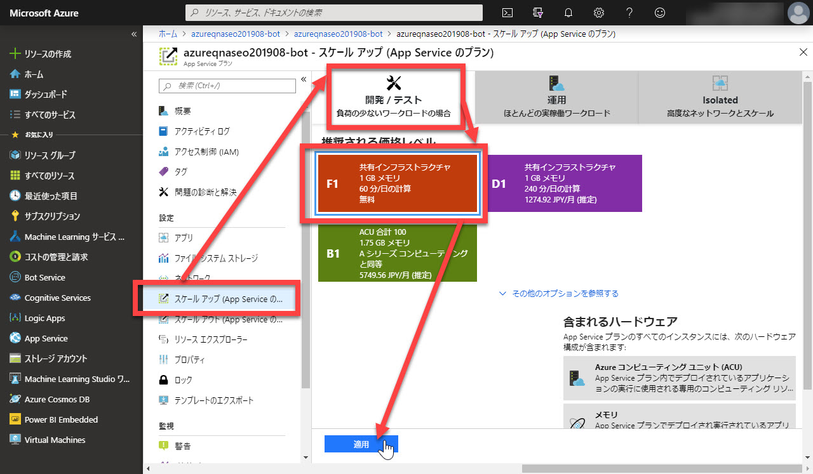

# QnA 学習済みモデルを発行する

[前のステップ](./02_train_and_test_qna.md) で、

- 外部から Q&A のデータをナレッジベースに取り込む
- ナレッジベースを学習する
 
ところまで終わりました。

以下では、

- 学習済みのモデルをクラウド上の QnA Service に発行する
- テスト用のチャットボット画面からサービスを呼び出す
- チャットボットのクライアントからサービスを呼び出す

を行います。

---

## 学習済みのモデルをクラウトの発行

学習したモデルをクラウトに発行します。

1. QnA Maker ポータルで [**PUBLISH**] を選択します。  
   

2. 確認画面で [**Publish**] をクリックします。  
   

3. [**Create Bot**] をクリックして Bot Service を作ります。  
   

4. Azure ポータルで "Web アプリボット" ブレードが開くので、以下を参考に入力・選択をします。  
   設定できたら [**作成**] をクリックします。

   |項目|値|
   |---|---|
   |ボット名|任意、ハンズオンではデフォルトのままでかまわない|
   |サブスクリプション|任意|
   |リソースグループ|QnA Makar で私用しているリソースグループ|
   |場所|任意、以下では "Japan East"|
   |価格レベル|選択可能ならば "F0"|
   |アプリ名|任意、ハンズオンではデフォルトのままでかまわない|
   |SDK 言語|任意、以下では C#|
   |App Service プラン/場所|別途説明|
   |Application Insights|ハンズオンでは "オフ"|

   [App Service プラン/場所] は新規作成して、場所を "Japan East" にするといいでしょう。（任意ではありますが）

     
     
   

5. 初期状態では、Web アプリボットは小さいながら有償プランで動作しています。これを無償の "F1" に変更します。  
   Web アプリボットブレードで [**すべての App Service 設定**] ウォン選択します。  
   

   > サブスクリプションで利用しているほかのサービスによっては、F プランが使えないことがあります。  
   > その場合は、他の小さめの有償プランを選択してください。

6. [App Service プラン] のリンクをクリックします。  
   

7. [**スケールアップ**] を選択してから、[開発/テスト]-[F1] を選択して [適用] をクリックします。  
   

以上で QnA 用の App Service の設定変更と起動ができました。

---

## テスト用のチャットボット画面からサービスを呼び出す

実際にサービスが動作しているか、テスト用のチャットボットから呼び出してみます。

1. Azure ポータルの "検索ボックス" に、ボットの名前（このコンテンツの手順通りならば "azureqna"）を入力して、検索結果から "Web アプリボット" を選択します。  
   

2. [**Web チャットでテスト**] を選択します。  
   

3. Azure ポータル内に Web チャットが表示されるので、何か質問を入力すると回答が返ってきます。  
   

以上で Q&A ボットが動作していて、クライアントからの呼び出しに応答していることが確認できました。

---

## チャットボットのクライアントからサービスを呼び出す

Azure ポータル内のテスト用 Web チャットから QnA ボットの呼び出しに成功したので、外部のチャットクライアントからも呼び出してみます。

1. Azure ポータルの "Web アプリボット" ブレードで [**チャンネル**] を選択します。  
   

2. [**チャンネルに接続**] が表示されます。  
   Bot Service ではデフォルトで "Web Chat" のみ接続されています。
3. [**ボットの埋め込みコードを取得**] をクリックします。  
   

4. Web チャットの埋め込みコード画面が表示されたら、[**埋め込みコード**] をコピーします。  
   テキストエディターを開いて、このコードを貼り付けます。  
   

   > Web チャットの埋め込みコードは非常に簡単なものです。  

   ```html
   <iframe src='https://webchat.botframework.com/embed/<作成したBot名>?s=シークレットを入力'  style='min-width: 400px; width: 100%; min-height: 500px;'></iframe>
   ```

5. [**シークレットキー**] を一つ [**表示**] させ、キーをコピーします。
6. テキストエディターに貼り付けた埋め込みコードの "**シークレットを入力**" 部分をシークレットキーで置換します。
7. 埋め込みコードの HTML を任意の名前で保存します。
8. 保存した HTML ファイルをブラウザーで開き、何か質問を入力すると回答が返ってきます。  
   

> 保存した HTMLファイルは iframe 要素しか持たないので、HTML として厳密には正しいフォーマットではありません。
> 実際には、埋め込みコードを適宜変更して、他の Web ページに埋め込んだりサイズを変更したりします。

---

以上で、QnA Service をクラウドに発行し、クライアントから呼びだすことが確認できました。

QnA Bot (Bot Service) は、複数のチャットクライアントに簡単に接続する機能を持っています。

他のチャットクライアントに対応するには、それぞれのアプリケーションのインストールや、外部サービスとの設定値の受け渡しなど、それぞれのサービス固有の設定が必要です。汎用な設定方法はありません。  
それらについては別途扱います。

以上で、シンプルな機能のチャットボットならば非常に簡単にサービス化できることが分かったと思います。
ぜひ、使えそうな業務や分野を考えて、QnA ボットを活用してください。
