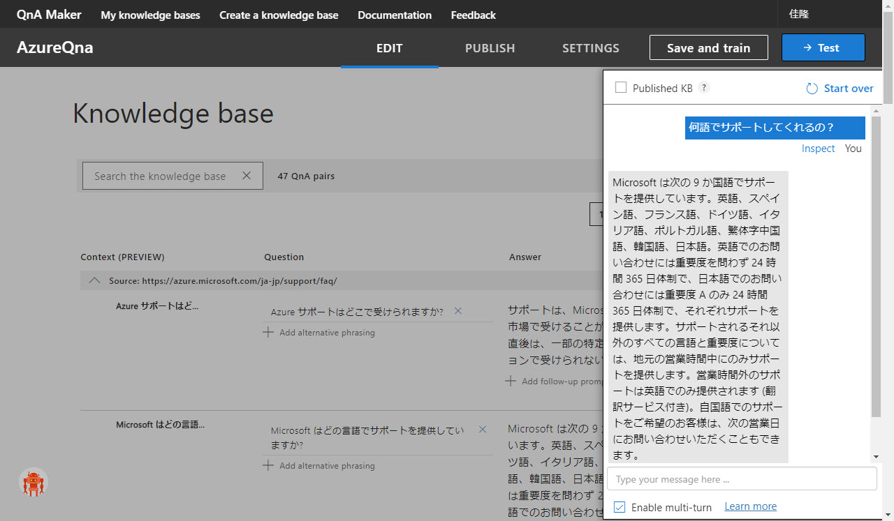

# Qna Maker で Q&A チャットボットを作成する

このコンテンツでは、[**QnA Maker**](https://www.qnamaker.ai/) を使って Q&A チャットボットを作成する手順を紹介します。

ここではノンコーディングで、シンプルな Q&A ボットを作ってみます。

> このコンテンツの実施には、Azure サブスクリプション（[**無償評価版**](https://azure.microsoft.com/ja-jp/free/) でも可）が必要です。

---

Q&A ボットの作成は、以下の流れで進めます。

1. [ナレッジベースの作成](./01_createknowledgebase.md)
2. [ナレッジの学習とテスト](./02_train_and_test_qna.md)
3. [QnA 学習済みモデルを発行する](./03_publishqnamodel.md)

> いくつかのチャンネル設定（既存のチャットクライアントに接続するための設定）や、ソースコードを編集して挙動を変更する手順なども追加したいと考えています。しばらくお待ちください。